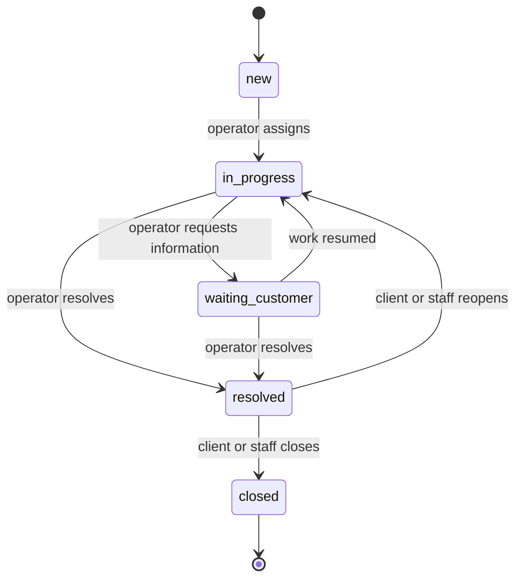
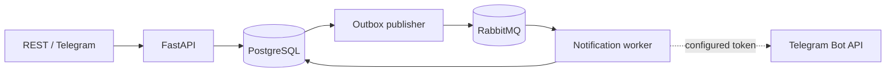

# HelpFlow

Backend-система технической поддержки с управляемым жизненным циклом заявок,
Telegram webhook, transactional outbox и асинхронными уведомлениями через
RabbitMQ.

## История проекта

- первоначальная разработка: ноябрь 2023 — июль 2024 года (период указан
  приблизительно);
- подготовка и публикация портфолио-версии: август 2026 года.

Репозиторий содержит актуализированную и документированную версию проекта,
подготовленную для публичного портфолио.

## Возможности

- регистрация и JWT-аутентификация;
- роли `client`, `operator` и `admin`;
- создание, назначение, фильтрация и просмотр заявок;
- контролируемые переходы между статусами;
- публичные и внутренние комментарии;
- полная история изменений заявки;
- привязка Telegram chat ID;
- создание заявки командой `/new Тема | Описание`;
- transactional outbox без потери события при сбое RabbitMQ;
- отдельные publisher и notification worker;
- идемпотентная регистрация доставки уведомлений;
- healthcheck PostgreSQL и RabbitMQ;
- OpenAPI, миграции, seed и интеграционные тесты.

## Жизненный цикл заявки



Недопустимый переход возвращает `409 Conflict`. Клиент видит только свои
заявки и не получает внутренние комментарии.

## Архитектура



API сохраняет заявку, историю и outbox-событие в одной транзакции. Publisher
отправляет неопубликованные события в RabbitMQ, а consumer записывает результат
доставки. Если Telegram token не задан, доставка получает статус `skipped`, но
полный event-driven сценарий остаётся наблюдаемым локально.

## Быстрый запуск

```bash
docker compose up --build --detach
```

После запуска:

- Swagger UI: <http://localhost:8020/docs>;
- healthcheck: <http://localhost:8020/health>;
- RabbitMQ Management: <http://localhost:15682>.

Демонстрационные учётные записи:

```text
admin@example.com / ChangeMe123!
operator@example.com / ChangeMe123!
```

Для внешнего окружения скопируйте `.env.example` в `.env`, замените секреты и
при необходимости задайте `HELPFLOW_TELEGRAM_BOT_TOKEN` и
`HELPFLOW_OPERATOR_TELEGRAM_CHAT_ID`.

## Тесты и проверки

```bash
docker compose --profile test up --build \
  --abort-on-container-exit --exit-code-from test test
docker compose rm --stop --force --volumes test database-test rabbitmq-test
```

```bash
uv sync --extra dev
uv run ruff format --check .
uv run ruff check .
uv run mypy src
```

## Стек

Python 3.12, FastAPI, Pydantic, SQLAlchemy 2, PostgreSQL 17, RabbitMQ, Pika,
JWT/RBAC, Telegram Bot API, Alembic, Docker Compose, pytest, HTTPX2, Ruff и mypy.

Подробные решения и сценарии отказа: [`docs/architecture.md`](./docs/architecture.md).

## English summary

HelpFlow is a containerized support-ticket backend. It provides JWT/RBAC,
ticket assignment and state transitions, public/internal comments, Telegram
webhook ingestion and asynchronous notifications. A transactional outbox keeps
database writes and RabbitMQ publication consistent, while the notification
consumer records idempotent delivery outcomes.
